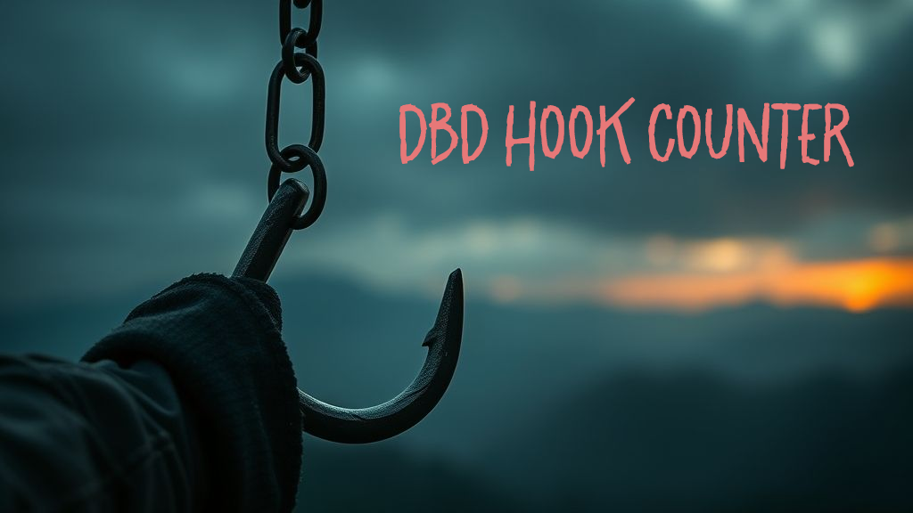
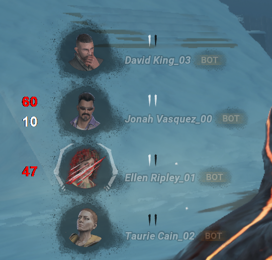
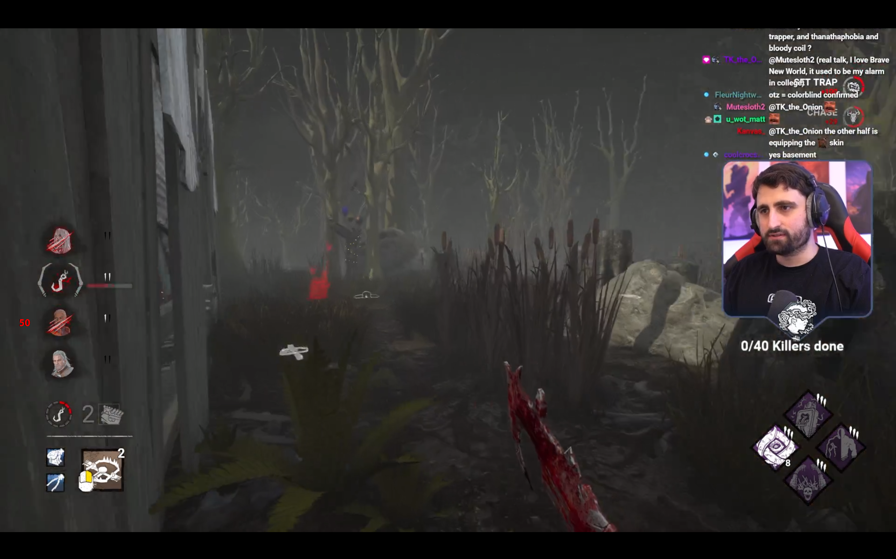
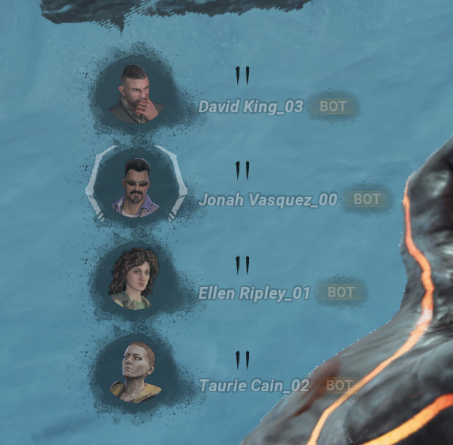

### [Download](https://github.com/olm1ghty/dbd-hook-counter/releases/download/1.2/DBD.Hook.Counter.zip)
**SHA256**: `C9A974AAEFBA1BC9FE09D14FCE02DB26CB801C31ADA2F5502E30D4083E86CCCC`

## *Display hook stages when playing killer*

This is a Dead by Daylight hook counter for killers (with additional features). It works by visually monitoring survivors' statuses on the screen and then displays them as an overlay.

❓ How it works

It's a Windows Forms app made with C#. I'm using Emgu.CV library to monitor the HUD.

Mostly, it monitors survivors' portraits and the space around them. When it sees that the survivor is hooked, it adds a hook stage on the screen. When it sees that the survivor is unhooked, it adds a DS and off-hook Endurance timer on the screen (optional, can be switched off).

## Features
- ⚙️ Fully automatic (HUD-based tracking)
- 🧠 Manual mode if you prefer full control
- 🎯 Hook stage counter for all survivors
- ⏱️ DS & Endurance timers (optional)
- 🖥️ Works on any resolution (16:9, 16:10)
- 🔒 Doesn’t store or send any data — it's all local and discarded immediately
- 🧼 Hides itself in menus, only shows in match
- 🧩 Doesn’t trigger anti-cheat (no memory access)
- 🧾 EULA-safe (like putting a sticky note on your screen)
- 🛠️ Fully open-source & customizable

🛡️ Why it's safe

- No game files are modified
- No memory is read
- Doesn’t interact with DBD’s process
- Just an overlay that analyzes HUD pixels

## Yes, it even works with video
Since it's not dependent on any game processes, you can apply it to a video feed. For example, turn it on while watching your favorite streamer to keep track of the game situation.

## How to use
> Supported platforms: only Windows.
---
> Works with DBD in `Windowed Fullscreen` mode. Doesn't work in Fullscreen mode - this mode doesn't allow for the overlay to be displayed on top of it.
---
> Multiple monitors? Launch the app on the same monitor you launch DBD.
---

1. Launch the app.
2. Shift + M to open settings.
3. Set UI and HUD scale to match those you have in DBD's graphics settings.
4. Save settings.
5. Play DBD while this app is running, and it will do its thing automatically.

You will know that it's set up correctly by seeing empty hook counters on the UI (only when the match starts):

    

If it doesn't work, try Shift + R to restart the app or make sure that you configured your UI/HUD scales correctly in the settings menu.

## Controls
- Shift + H - Hot keys.
- Shift + M - Settings.
- Shift + K - Exit the app.
- Shift + R - Restart the app.
- Shift + P - Pause/Unpause the app (if playing survivor, for example)
- 1/2/3/4 - Manually add a hook stage. If the hook counter is at 2, set it to 0.
- 5 - Clear all hook stages.
- Shift + 1/2/3/4 - Manually trigger unhook timers.
- Shift + 5 - Clear all timers.

## Antivirus
The app is unsigned, so your antivirus might view it as a threat.

**SHA256**: `C9A974AAEFBA1BC9FE09D14FCE02DB26CB801C31ADA2F5502E30D4083E86CCCC`

This hash lets users verify the file is untampered with. If you’re unsure, scan the file on [VirusTotal](https://virustotal.com/) or build from source.

## Contact me
Ping me on Discord: "0lmighty"

## Acknowledgements
[@Nemonn](https://github.com/nemonn) - Thanks for helping out with the materials and for the good advice!